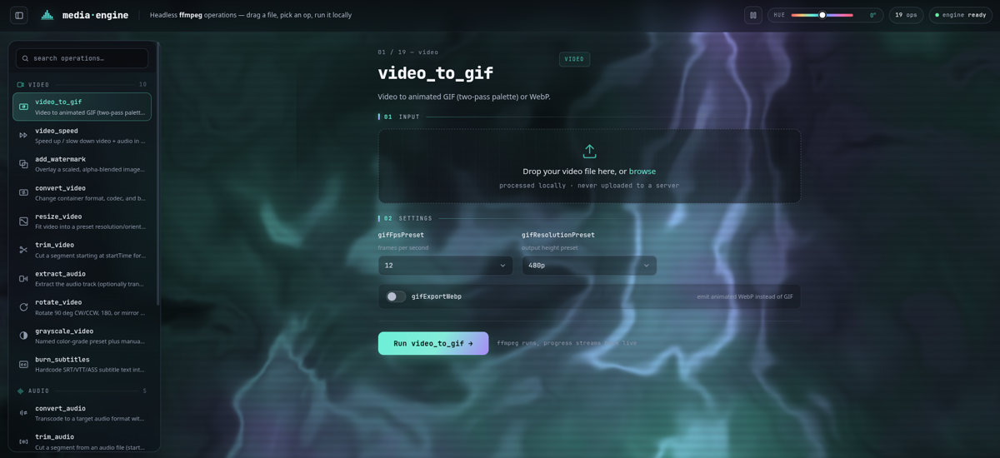
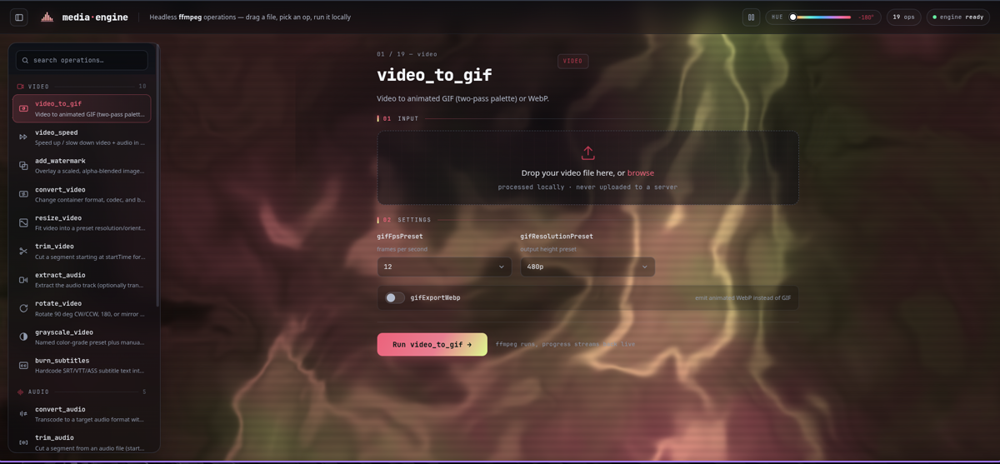

<p align="center">
  
</p>

<p align="center">
  <a href="LICENSE"></a>
  
  
  
</p>

A standalone, headless media-processing engine: **19 ffmpeg recipes** for video, audio, and
still images, defined once in a single operations registry and driven through **three
interchangeable faces** — a CLI, an [MCP](https://modelcontextprotocol.io) server, and a
drag-and-drop web UI. The engine and two of the three faces are **pure Python stdlib**;
ffmpeg is the only external binary. Everything runs locally — your files never leave your
machine.

<p align="center">
  
  
</p>
<p align="center"><sub>The web UI running <code>video_to_gif</code> — drag a file, tune the auto-generated form, watch ffmpeg run live. <em>Same page, hue knob rotated:</em> every accent is one CSS variable and shader/canvas uniform, so the whole palette and the animated background recolor instantly (and the motion can be paused to save resources).</sub></p>

```
                      ┌──────────────────────────────┐
  cli.py ────────────►│                              │
  server.py (MCP) ───►│   OPERATIONS registry (19)   ├──► ffmpeg
  webserver.py ──────►│   validate → probe → build   │
                      └──────────────────────────────┘
```

Add an operation once and it appears in all three faces automatically — as a CLI
subcommand, as a typed MCP tool, and as an auto-generated web form. Zero per-face code.

## Contents

- [Highlights](#highlights)
- [Quick start](#quick-start)
- [The three faces](#the-three-faces)
  - [CLI](#cli)
  - [MCP server](#mcp-server)
  - [Web UI](#web-ui)
- [Operations](#operations)
- [Architecture](#architecture)
- [Portability](#portability)
- [Provenance](#provenance)
- [License](#license)

## Highlights

- **One registry, three faces.** Every operation is a declarative `Operation` entry
  (typed params, an ffmpeg command builder, an output-extension rule). The CLI, the MCP
  server, and the web UI are thin projections of that one registry.
- **Zero dependencies.** The engine, the CLI, and the web UI need nothing but Python and
  ffmpeg — no pip install, no venv, no build step. Only the MCP face pulls in one package
  (`fastmcp`).
- **Runs on old and new ffmpeg.** A version probe picks `-fps_mode` (ffmpeg ≥ 5) or the
  legacy `-vsync` automatically, so the same code runs on a stock Ubuntu ffmpeg 4.4 and on
  current builds. All 19 operations are verified end-to-end on ffmpeg 4.4.2.
- **Honest progress.** Progress comes from ffmpeg's machine-readable `-progress pipe:1`
  stream, not from scraping locale-dependent stderr — it feeds the CLI progress line and
  the web UI's live SSE updates alike.
- **Local and private.** No network calls, no telemetry, no cloud. The web UI binds
  `127.0.0.1` by default and processes uploads in throwaway temp workdirs.

## Quick start

```bash
git clone https://github.com/constant-itis/media-engine.git
cd media-engine

ffmpeg -version        # any reasonably recent build; 4.4+ verified

# CLI — no install at all
python3 cli.py list
python3 cli.py run video_to_gif -i clip.mp4 -o clip.gif

# Web UI — no install either
python3 webserver.py   # then open http://127.0.0.1:8765

# MCP server — the one face with a dependency
pip install -r requirements.txt
python3 server.py
```

If ffmpeg/ffprobe aren't on `PATH`, point at them with the `FFMPEG_BIN` / `FFPROBE_BIN`
environment variables.

## The three faces

### CLI

```
python3 cli.py list                 # all operations, one line each
python3 cli.py info <op>            # params, types, ranges, defaults
python3 cli.py run  <op> -i IN -o OUT [--param value ...]
```

Real examples:

```bash
# two-pass palette GIF at 15 fps, 480p
python3 cli.py run video_to_gif  -i clip.mp4  -o clip.gif  --gifFpsPreset 15 --gifResolutionPreset 480p

# 50% faster, video and audio kept in sync
python3 cli.py run video_speed   -i clip.mp4  -o fast.mp4  --speed 50

# transcode to opus with EBU R128 loudness normalization
python3 cli.py run convert_audio -i song.wav  -o song.opus --audioFormat opus --normalizeLoudness true

# watermark, bottom-right, 18% of frame width
python3 cli.py run add_watermark -i clip.mp4  -o marked.mp4 --coverImage logo.png --watermarkPosition bottom-right

# print the exact ffmpeg command(s) without running them
python3 cli.py run video_to_gif  -i clip.mp4  -o clip.gif  --dry-run
```

Every param takes a value (booleans included: `--gifExportWebp true`). `run` also accepts
`--threads N`, `--quiet`, and `--dry-run` — dry-run prints the fully-assembled ffmpeg
invocations, which doubles as a recipe reference.

### MCP server

`server.py` exposes the registry over the Model Context Protocol as a stdio server —
**one typed tool per operation**, auto-generated from the same `OPERATIONS` registry.
Choice params become enum-constrained schema fields, numeric ranges and defaults carry
over, `output_path` is optional (derived next to the input as `{stem}_{op}.{ext}`), and
every tool accepts `dry_run`. A `list_operations` tool covers discovery.

```bash
pip install -r requirements.txt      # fastmcp — the engine itself stays stdlib
python3 server.py                    # stdio entrypoint your MCP client launches
```

Register it with any MCP-compatible client:

```json
{
  "mcpServers": {
    "media-engine": {
      "command": "python3",
      "args": ["/absolute/path/to/media-engine/server.py"]
    }
  }
}
```

Tool results return the output path, the ffmpeg command(s) run, and pass counts;
failures come back as `{"ok": false, "error": ...}` with the ffmpeg stderr tail.

### Web UI

`webserver.py` serves a single-page drag-and-drop UI over stdlib `http.server` — no
frameworks, no build step, no dependencies. The whole frontend is one self-contained
`web/index.html` (vanilla JS, inline styles, embedded font and icons).

```bash
python3 webserver.py                      # http://127.0.0.1:8765
python3 webserver.py --host 0.0.0.0 --port 9000
```

Drop in a file, pick an operation (deep-linkable as `/#video_to_gif`), tweak the
**auto-generated parameter form**, run. The op executes in a background thread inside a
temp workdir, progress streams live over **Server-Sent Events**, and the result previews
in-browser (image/video) with a download button. Abandoned jobs are reaped after 30
minutes.

The HTTP API underneath is plain and scriptable:

| Route | Method | Purpose |
|---|---|---|
| `/` | GET | the UI (`web/index.html`) |
| `/api/operations` | GET | full registry as JSON (params, types, ranges, defaults) |
| `/api/run/<op>` | POST | multipart upload (file field `__input__` + param fields) → `{job_id}` |
| `/api/progress/<job_id>` | GET | live progress as an SSE stream |
| `/api/result/<job_id>` | GET | download the output (one-shot; workdir cleaned after) |
| `/health` | GET | liveness check |

> **Security note:** the server runs ffmpeg on uploaded input and binds localhost by
> default. Don't expose it to an untrusted network.

## Operations

19 operations — 10 video, 5 audio, 4 image. Full parameter details for any op:
`python3 cli.py info <op>` (or `/api/operations`, or the MCP tool schemas — same data).

### Video

| Operation | Description | Params |
|---|---|---|
| `video_to_gif` | Video to animated GIF (two-pass palette) or WebP | `gifFpsPreset` `gifResolutionPreset` `gifExportWebp` |
| `video_speed` | Speed up / slow down video + audio in sync (atempo-chained) | `speed` (−100…100 %) |
| `add_watermark` | Overlay a scaled, alpha-blended image watermark | `coverImage` `watermarkPosition` `watermarkSize` `watermarkOpacity` `watermarkX` `watermarkY` |
| `convert_video` | Change container format, codec, and bitrate | `videoFormat` `videoCodec` `videoBitrate` |
| `resize_video` | Fit into a preset resolution/orientation frame with letterbox padding | `resolutionPreset` `resizeVideoFormat` |
| `trim_video` | Cut a segment starting at `startTime` for `duration` (re-encodes) | `startTime` `duration` |
| `extract_audio` | Extract the audio track (optionally transcoding), or strip audio entirely | `extractAudioAction` `extractAudioFormat` `extractAudioBitrate` |
| `rotate_video` | Rotate 90° CW/CCW, 180°, or mirror horizontally | `rotation` |
| `grayscale_video` | Named color-grade preset plus manual brightness/contrast/saturation trim | `styleMode` `styleIntensity` `brightnessAdjust` `contrastAdjust` `saturationAdjust` |
| `burn_subtitles` | Hardcode SRT/VTT/ASS subtitles into the video frame (irreversible) | `subtitles` |

### Audio

| Operation | Description | Params |
|---|---|---|
| `convert_audio` | Transcode to a target format with optional loudness normalize / volume boost | `audioFormat` `normalizeLoudness` `volumeBoostPercent` `outputSampleRate` `bitrate` |
| `trim_audio` | Cut a segment from an audio file (start + duration) | `startTime` `duration` |
| `audio_settings` | Channel-layout change, full reverse, and/or fade in/out in one pass | `audioChannelMode` `reverseAudioEnabled` `fadeInDuration` `fadeOutDuration` |
| `add_metadata` | Write/remove ID3-style text metadata and embed/strip cover art, per container support | `coverImage` `metadataArtist` `metadataTitle` `metadataReleaseDate` `metadataGenre` `removeCover` `removeAllMetadata` |
| `audio_speed` | Change audio tempo (atempo-chained; same percent scale as `video_speed`) | `speed` (−100…100 %) |

### Image

| Operation | Description | Params |
|---|---|---|
| `resize_image` | Resize/reformat a still image to a target aspect ratio and size | `imageAspectRatio` `imageResizePreset` `imageCustomWidth` `imageCustomHeight` `imageOutputFormat` |
| `rotate_image` | Rotate 90°/180° and/or flip horizontally/vertically | `rotation` `flipHorizontal` `flipVertical` |
| `grayscale_image` | Black-and-white via intensity-blended color mixer plus preset contrast/brightness | `blackWhiteMode` `blackWhiteIntensity` `blackWhiteContrast` `blackWhiteBrightness` |
| `sharpness_image` | Box blur and/or unsharp-mask sharpening | `sharpenAmount` `blurStrength` |

## Architecture

```
engine/
  opmodel.py      the model: Param (typed, validated) · Context · Operation
  ops/
    video.py      10 video operations
    audio.py       5 audio operations
    image.py       4 image operations
  operations.py   registry aggregator + run_operation (validate → probe → build → run)
  ffmpeg.py       process layer: binary resolution, -progress pipe:1 parsing,
                  bounded stderr tails, version capability probe, per-OS null device
  probe.py        ffprobe → MediaInfo (dimensions, duration, bitrates, audio presence)
cli.py            CLI face
server.py         MCP face (one typed tool per op, generated from the registry)
webserver.py      web face (stdlib http.server + SSE job streaming)
web/index.html    the entire frontend — one self-contained page, no build step
recon/            upstream recipe inventory + porting assessment
```

An operation is data plus one function:

```python
Operation(
    id="video_to_gif", category="video",
    description="Video to animated GIF (two-pass palette) or WebP.",
    params=[Param("gifFpsPreset", "choice", 12, choices=[8, 10, 12, 15, 24, 25, 30, 50, 60]), ...],
    build=_build_gif,                 # Context -> [Pass, ...] (the ffmpeg invocations)
    output_ext=lambda p: "webp" if p.get("gifExportWebp") else "gif",
    needs_probe=False,                # True = run ffprobe first, results in ctx.info
)
```

`run_operation` validates params against the declared specs, probes the input if the op
asks for it, calls `build` to get one or more ffmpeg `Pass`es (multi-pass recipes like
palette-gen GIF just return two), and executes them with live progress. Temp files
created via `ctx.tempfile()` are cleaned up automatically.

**To add an operation:** write a `_build_<op>(ctx)` function and append an
`Operation(...)` entry in the right `engine/ops/*.py` module. That's the whole job — the
CLI subcommand, the typed MCP tool, and the web form all materialize from the entry.

## Portability

- **ffmpeg version probe** — `-fps_mode passthrough` only exists on ffmpeg ≥ 5.0;
  `engine/ffmpeg.py` parses `ffmpeg -version` once and falls back to the legacy
  `-vsync passthrough` on older builds (verified end-to-end on 4.4.2; the modern-flag
  path is the same one the upstream recipes used against ffmpeg 6.x).
- **Per-OS null device** — `/dev/null` vs `NUL` chosen at runtime.
- **Binary resolution** — `PATH` lookup with `FFMPEG_BIN` / `FFPROBE_BIN` env overrides;
  no `.exe` assumptions.
- **Machine-readable progress** — `-progress pipe:1` key-value stream instead of parsing
  locale/version-dependent stderr `time=` lines.
- **Python** — 3.9+, stdlib only (dataclasses, `argparse`, `http.server`,
  `subprocess`). The MCP face additionally follows `fastmcp`'s Python requirement.

## Provenance

The recipes were ported and adapted from
[**media-by-outlaw2082**](https://github.com/Outlaw2082/media-by-outlaw2082) (GPL-3.0), an
Electron GUI over ffmpeg — credit to Outlaw2082 for the original operation set and
command recipes. This project reimplements them as a headless, dependency-free engine,
keeping the recipes' behavior while fixing a few issues found during the port:

- `rotate_video` "Mirror" was exposed upstream but had no filter mapping (silent no-op);
  it now emits `hflip`.
- `trim_audio` / `audio_settings` relied on ffmpeg's default-encoder-by-extension guess;
  the codec is now set explicitly.
- `audio_speed` labeled its input "percent" but clamped a raw 0.5–2.0 factor; it now uses
  the same percent scale as `video_speed` with an atempo chain (no 2× ceiling).
- `sharpness_image` mapped its slider to `unsharp` amounts up to 20, outside ffmpeg's
  valid `[-2, 5]` range (errored on every build); remapped to 0–5.

The `recon/` directory documents the original operation inventory and the porting
assessment.

## License

[GPL-3.0](LICENSE) — inherited from the upstream project the recipes derive from, and
kept gladly.
